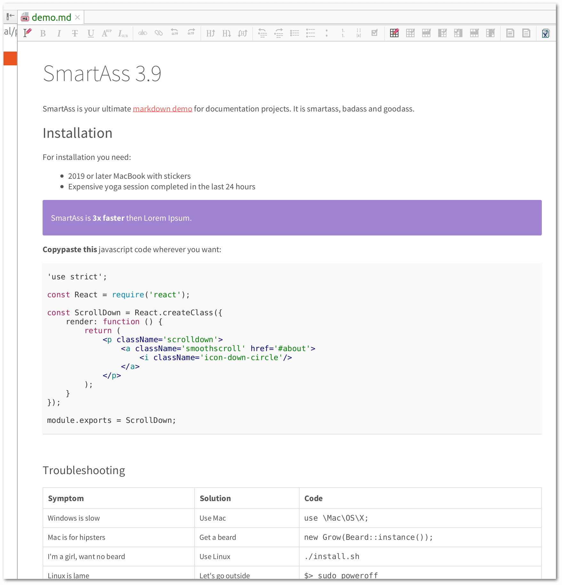
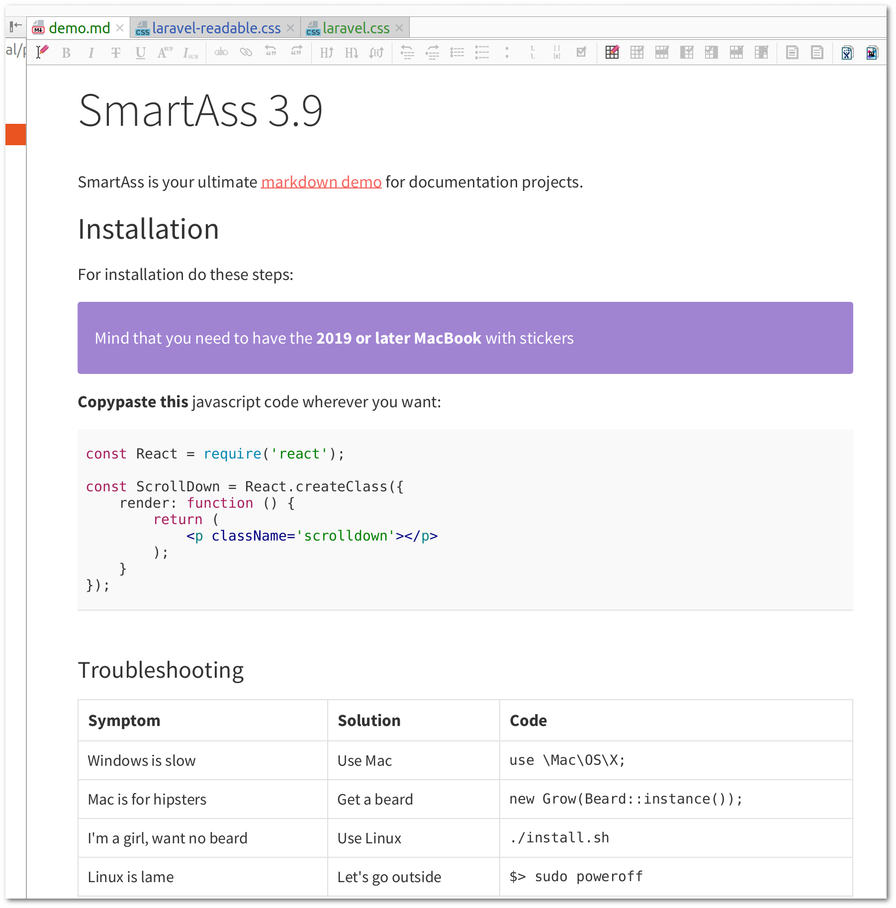
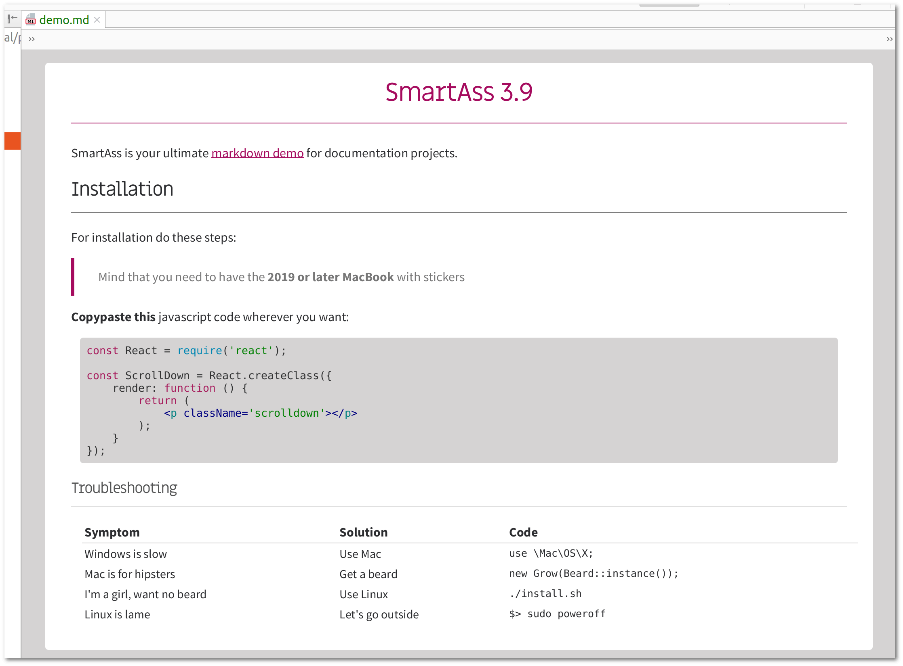

# PhpStorm Tweaks For Laravel Projects

> This is a collection of minor PhpStorm tweaks for Laravel projects.

## Markdown Style

In case you're using the
[Markdown Navigator Plugin](https://plugins.jetbrains.com/plugin/7896-markdown-navigator) (which I
think you should) it has an option to customize the stylesheet.

### Styles Available

| Style            | File                                               | What it is                                                                   |
|:-----------------|:---------------------------------------------------|:-----------------------------------------------------------------------------|
| Laravel          | [md/laravel-2018.css](md/laravel.css)              | The original laravel.com/docs style (except for the copyrighted Whitney font |
| Laravel Readable | [md/laravel-readable.css](md/laravel-readable.css) | The laravel.com/docs style with improved readability                         |
| Vanilo           | [md/vanilo.css](md/vanilo.css)                     | vanilo.io/docs style                                                         |

### Settings styles

> Install the
> [Markdown Navigator Plugin](https://plugins.jetbrains.com/plugin/7896-markdown-navigator) if you
> haven't done it yet.

1. In PhpStorm go to Settings => Languages and Frameworks => Markdown => Preview
2. Set **Preview Browser** to _JavaFX WebView_
3. Tick **Grayscale Font Smoothing**
4. Navigate to the Stylesheet pane on the left
5. Set **Scheme** to _Default_ (so that document bg is white)
6. Set **Stylesheet** to _Default JavaFX Stylesheet_
7. Set the Laravel-like style by either
   1. Tick **Apply Custom CSS text** and copypaste the content of the above linked CSS above
   2. or tick **Apply CSS from URI** and link to
      https://raw.githubusercontent.com/fulopattila122/phpstorm-tweaks-for-laravel/master/md/navigator.css

#### Laravel Markdown Style

#### Laravel Readable Markdown Style

#### Vanilo Markdown Style

