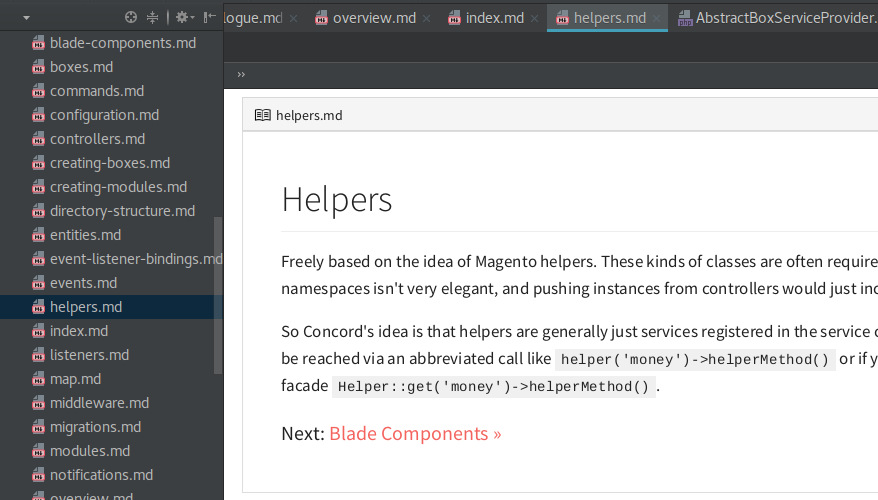

# PhpStorm Tweaks For Laravel Projects

> This is a collection of minor tweaks for making your PhpStorm a bit more Laravel-like.

## Markdown Style



In case you're using the [Markdown Navigator Plugin](https://plugins.jetbrains.com/plugin/7896-markdown-navigator) (which I think you should) it has an option to customize the stylesheet. Taken the style from the Laravel Documentation site the following CSS will make your docs feel home.

```css
@import url('https://fonts.googleapis.com/css?family=Source+Sans+Pro:300,300i,400,400i,400b');

body, p, ul, ol, li, table, td, th {
    font-family: "Source Sans Pro", sans-serif;
    color: #222;
}

p {
    font-size: 17px;
}

h2, h3, h4, h5 {
    font-family: "Source Sans Pro", sans-serif;
    font-weight: 400;
}

h1 {
    font-family: "Source Sans Pro", sans-serif;
    font-weight: 300;
}

a, a:visited {
    color: #f4645f;
}

img {
    border: 0!important;
}
```

### Steps For Perfect Markdown Preview

> Install the [Markdown Navigator Plugin](https://plugins.jetbrains.com/plugin/7896-markdown-navigator) if you haven't done it yet.

1. In PhpStorm go to Settings => Languages and Frameworks => Markdown => Preview
2. Set **Preview Browser** to _JavaFX WebView_
3. Tick **Grayscale Font Smoothing**
4. Navigate to the Stylesheet pane on the left
5. Set **Scheme** to _Default_ (so that document bg is white)
6. Set **Stylesheet** to _Default JavaFX Stylesheet_
7. Set the Laravel-like style by either
    1. Tick **Apply Custom CSS text** and copypaste the CSS above
    2. or tick **Apply CSS from URI** and link to https://raw.githubusercontent.com/fulopattila122/phpstorm-tweaks-for-laravel/master/md/navigator.css


